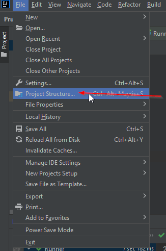

# Prueba automatizacion servicio web GML

  
  

#Ejecucion del proyecto

requiere:
- JDK 1.8
- maven 3.8.6
- configurar JDK desde intellij

- seleccionar la version 1.8

- ejecutar la clase Runner

#Generar reporte
- Desde la terminal ejecutar el comando: mvn serenity:aggregate
- El reporte se generara en la ruta PruebaGML\target\site\serenity\index.html